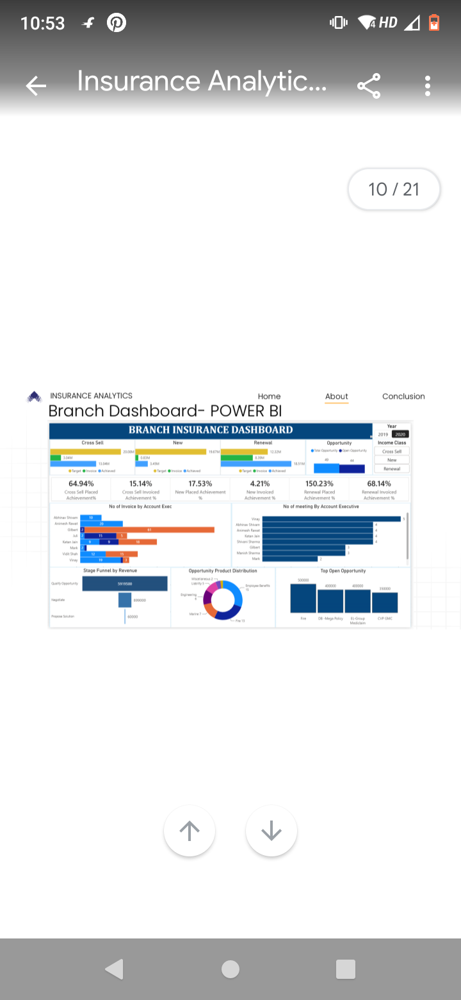
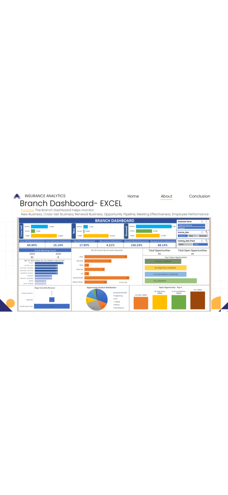
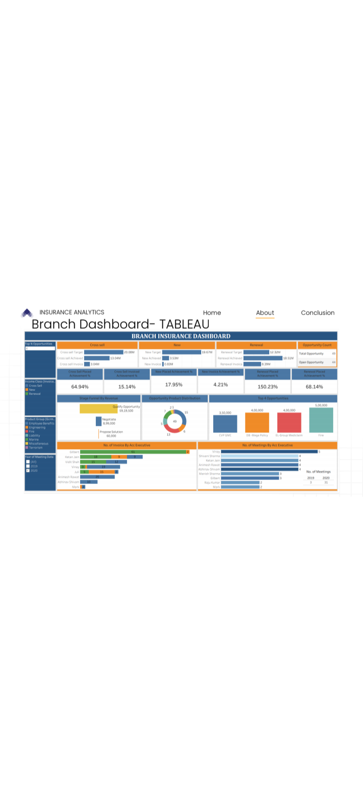
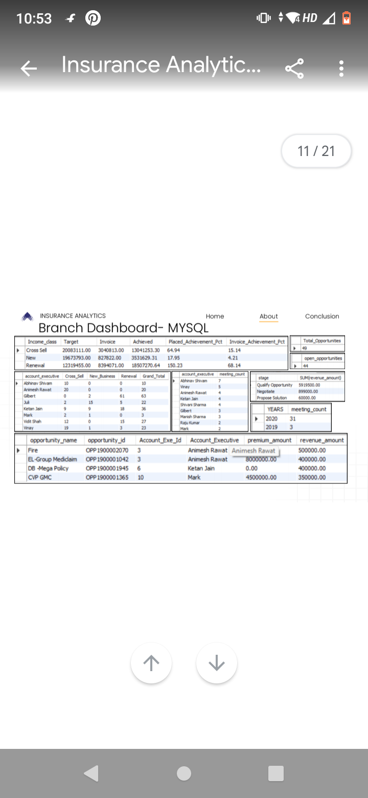

# Insurance Analytics - End to End Data Analyst Project

## 📌 Project Objectives
To analyze branch performance, policy performance, customer trends, claims, and business growth to support data-driven decisions.

## 📊 Key Performance Indicators (KPIs)
- **Total Policies**: Total policy management by company
- **Total Customers**: Size of customer base  
- **Policies Expiring This Year**: Identifies renewal opportunities
- **Premium Growth Rate**: Measures premium revenue growth over time
- **Total Claim Amount**: Tracks financial impact of claims

## 💡 Key Business Insights
- Renewal business exceeded target, indicating strong customer retention
- Some account executives generated significantly higher invoice revenue
- High-value open opportunities remain in the pipeline

## 📁 Project resorses 
### 📊 Sample Data Files
- [Individual Budgets](Individual%20Budgets.xlsx)
- [Opportunity Data](Opportunity.xlsx)
- [Brokerage Data](brokerage.xlsx)
- [Fees Data](fees.xlsx)
- [Invoice Data](invoice.xlsx)
- [Meeting Data](meeting.xlsx)

  ## 📈 Key Insights

- **Top Performing Branch**: Mumbai branch ne 24% revenue generate kiya
- **Highest Claims**: Motor Insurance me 38% claim ratio hai
- **Agent Performance**: Top 10 agents 45% total business laate hain
- **Opportunity**: Health insurance me 20% growth potential hai
|  |  |
| *Branch KPIs & Revenue* | *Claims & Policy Analysis* |

|  |  |
| *Interactive Branch Dashboard* | *SQL Query Results* |
  ## 📊 Dashboards

| Power BI Dashboard | Excel Dashboard |
| --- | --- |
|  |  |

| Tableau Dashboard | MySQL Dashboard |
| --- | --- |
|  |  |

## 🔧 Tech Stack
`Excel` | `Power BI` | `Tableau` | `MySQL` | `Python`

## 📽️ Project Presentation

Complete project walkthrough:
📊 [Download PPT](./Insurance%20Analytics%20DA%20PPT.pdf)
